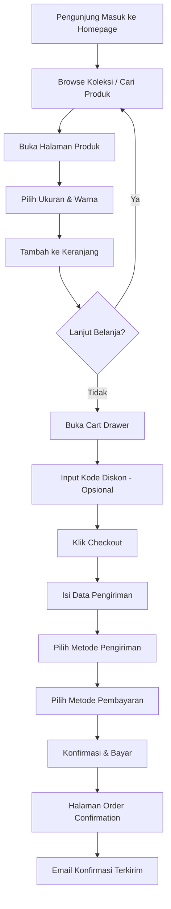
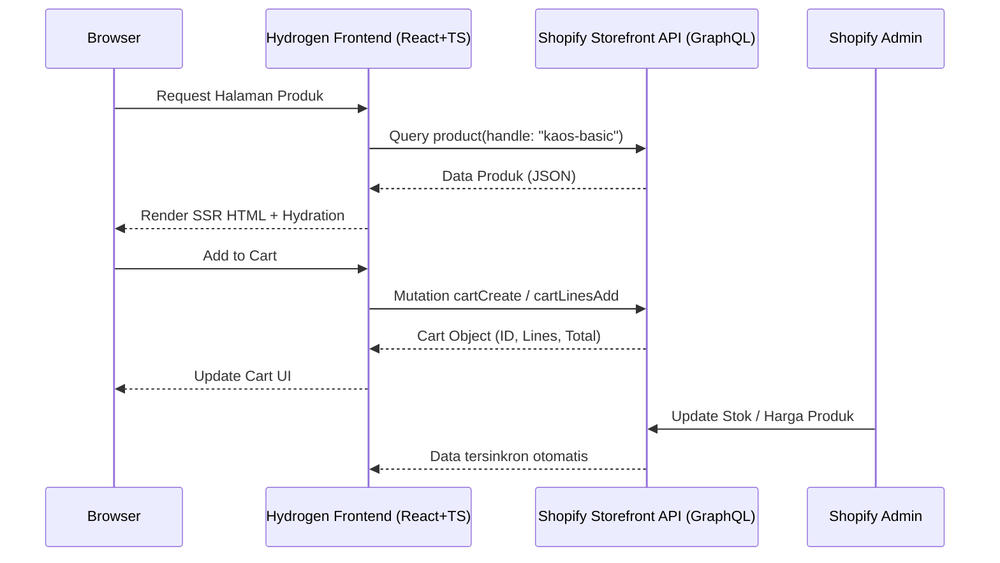
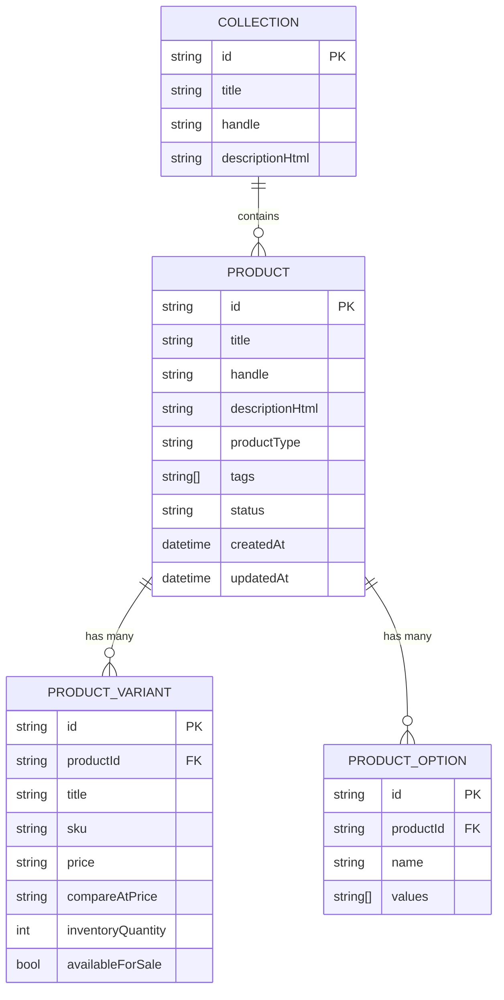

# PRD — Toko Fashion Shopify (Referensi: Erigo Store)

**Versi:** 1.0  
**Tanggal:** 24 Mei 2026  
**Status:** Draft

---

## 1. Overview

Proyek ini bertujuan membangun toko online fashion berbasis **Shopify** yang menjual kaos, kemeja, dan pakaian kasual pria/wanita dengan mengacu pada model bisnis dan estetika visual [Erigo Store](https://erigostore.co.id/) — brand lokal Indonesia yang sukses dengan identitas "affordable street fashion".

Target pasar utama adalah generasi muda Indonesia (usia 16–30 tahun) yang mencari pakaian kasual berkualitas dengan harga terjangkau. Toko ini dibangun di atas platform Shopify dengan tema yang dapat dikustomisasi menggunakan **TypeScript + Hydrogen** untuk storefront yang cepat dan modern.

**Tujuan utama:**
- Membangun storefront Shopify yang menarik, cepat, dan mobile-first.
- Menyediakan pengalaman belanja yang mulus dari halaman produk hingga checkout.
- Menghadirkan identitas brand yang kuat dan konsisten di seluruh halaman.

---

## 2. Requirements

Persyaratan tingkat tinggi yang harus dipenuhi:

- **Platform:** Shopify (plan Basic ke atas), dengan opsi Hydrogen untuk custom storefront.
- **Bahasa Pemrograman:** TypeScript (untuk pengembangan theme/storefront kustom).
- **Aksesibilitas:** Dapat diakses via web browser desktop dan mobile (mobile-first).
- **Pengguna:**
  - **Pembeli (Customer):** Dapat browse produk, menambah ke cart, checkout, dan melacak pesanan.
  - **Admin (Merchant):** Mengelola produk, stok, pesanan, dan diskon melalui Shopify Admin.
- **Pembayaran:** Mendukung payment gateway lokal Indonesia (Midtrans / Xendit) dan kartu kredit.
- **Pengiriman:** Integrasi dengan jasa pengiriman lokal (JNE, J&T, SiCepat).
- **Performa:** Waktu muat halaman < 2.5 detik (LCP), skor Lighthouse > 85.

---

## 3. Core Features

Fitur-fitur kunci yang harus ada dalam versi pertama (MVP):

### 3.1 Storefront (Frontend)

1. **Homepage**
   - Hero banner full-width dengan koleksi terbaru atau promo aktif.
   - Seksi "New Arrivals" — 8 produk terbaru dalam grid.
   - Seksi "Best Sellers" — produk terlaris.
   - Seksi koleksi/kategori (Kaos, Kemeja, Celana, Aksesoris).
   - Banner promosi / announcement bar di bagian atas.

2. **Halaman Koleksi (Collection Page)**
   - Grid produk responsif (2 kolom mobile, 3–4 kolom desktop).
   - Filter berdasarkan: Ukuran, Warna, Harga, Kategori.
   - Sorting: Terbaru, Terlaris, Harga Terendah/Tertinggi.
   - Infinite scroll atau pagination.

3. **Halaman Detail Produk (Product Detail Page)**
   - Galeri foto produk (utama + thumbnail, zoom on hover).
   - Selector varian: Ukuran (XS/S/M/L/XL/XXL) dan Warna.
   - Tabel panduan ukuran (size guide modal).
   - Tombol "Tambah ke Keranjang" dan "Beli Sekarang".
   - Informasi stok real-time ("Tersisa 3 lagi!").
   - Seksi produk terkait / "Kamu mungkin suka".
   - Tab deskripsi, detail material, dan panduan perawatan.

4. **Keranjang Belanja (Cart)**
   - Slide-in cart drawer (tanpa pindah halaman).
   - Edit kuantitas dan hapus item langsung dari cart.
   - Tampilan subtotal, estimasi ongkos kirim, dan kode diskon.

5. **Checkout**
   - Alur checkout bawaan Shopify yang dioptimalkan.
   - Dukungan guest checkout (tanpa perlu daftar).
   - Input kode promo/diskon.

6. **Halaman Pencarian**
   - Search bar dengan autocomplete (live search).
   - Hasil pencarian dengan filter dan sorting.

7. **Halaman Akun Pelanggan**
   - Riwayat pesanan dan status pengiriman.
   - Manajemen alamat pengiriman.
   - Wishlist produk.

### 3.2 Admin Panel (Shopify Backend)

1. **Manajemen Produk**
   - Tambah/edit/arsipkan produk dengan varian (ukuran & warna).
   - Upload foto produk (minimal 3 foto per produk: depan, belakang, detail).
   - Pengaturan SKU, barcode, dan berat produk.

2. **Manajemen Stok**
   - Tracking inventori per varian per lokasi.
   - Notifikasi stok rendah (threshold dapat dikonfigurasi).

3. **Manajemen Pesanan**
   - Tampilan daftar pesanan dengan status (Pending, Diproses, Dikirim, Selesai).
   - Cetak label pengiriman.
   - Refund dan pengembalian barang.

4. **Diskon & Promosi**
   - Buat kode diskon persentase atau nominal.
   - Flash sale dengan waktu terbatas.
   - Program bundle (beli 2 gratis 1, dsb.).

---

## 4. User Flow

### 4.1 Alur Pembelian (Happy Path)

### 4.2 Alur Admin Menambah Produk

1. Login ke Shopify Admin.
2. Navigasi ke **Products → Add Product**.
3. Isi judul, deskripsi, dan kategori produk.
4. Upload minimal 3 foto (depan, belakang, detail tekstur).
5. Tambahkan varian: pilih opsi **Ukuran** dan **Warna**.
6. Set harga, harga coret (compare at price), dan SKU per varian.
7. Atur stok awal per varian.
8. Simpan sebagai Draft → Review → Publish (Active).

---

## 5. Architecture

### 5.1 Pilihan Stack

| Pendekatan | Stack | Kapan Digunakan |
|---|---|---|
| **Opsi A (Standar)** | Shopify Theme (Liquid + TS) | Cepat deploy, cocok MVP |
| **Opsi B (Custom)** | Shopify Hydrogen (React + TS) | Performa tinggi, full custom |

Rekomendasi untuk tahap awal: **Opsi A** — gunakan tema Shopify (contoh: Dawn) yang dikustomisasi dengan TypeScript di bagian `assets/`. Migrasi ke Hydrogen bisa dilakukan di fase berikutnya.

### 5.2 Diagram Arsitektur (Opsi B — Hydrogen)

### 5.3 Integrasi Eksternal

| Layanan | Fungsi | Integrasi |
|---|---|---|
| **Midtrans / Xendit** | Payment gateway lokal | Shopify Payment App |
| **JNE / J&T / SiCepat** | Kalkulator ongkos kirim | Shopify Carrier Service API |
| **Meta Pixel** | Tracking iklan Facebook/Instagram | Shopify Marketing |
| **Google Analytics 4** | Analitik pengunjung | Shopify Integration |
| **WhatsApp Business** | Customer service chat | Third-party app (Tidio/Crisp) |

---

## 6. Data Schema (Shopify)

### 6.1 Struktur Produk

### 6.2 Struktur Koleksi (Kategori)

| Koleksi | Handle | Deskripsi |
|---|---|---|
| New Arrivals | `new-arrivals` | Produk 30 hari terakhir (Smart Collection) |
| Best Sellers | `best-sellers` | Produk terlaris otomatis |
| Kaos Polos | `kaos-polos` | Kategori kaos tanpa motif |
| Kaos Grafis | `kaos-grafis` | Kategori kaos bermotif/bergambar |
| Kemeja | `kemeja` | Seluruh varian kemeja |
| Celana | `celana` | Celana panjang dan pendek |
| Sale | `sale` | Produk dengan tag "sale" (Smart Collection) |

---

## 7. Design & Technical Constraints

### 7.1 Identitas Visual (Mengacu Erigo)

- **Tone:** Streetwear urban, modern, clean, dan berani.
- **Warna Utama:** Hitam dan putih sebagai dasar; aksen warna bold (merah/kuning/olive) untuk highlight.
- **Tipografi:**
  - **Display/Heading:** Font tebal, condensed — contoh: `Bebas Neue` atau `Barlow Condensed Bold`.
  - **Body:** Sans-serif bersih — contoh: `Inter` atau `DM Sans`.
- **Imagery:** Foto model dengan background bersih (putih/abu) atau lifestyle outdoor. Minimal 3 foto per produk.
- **UI Style:** Tombol bersudut tajam (border-radius kecil), layout grid bersih, whitespace generous.

### 7.2 Persyaratan Teknis

1. **TypeScript:** Seluruh custom JavaScript di theme harus ditulis dalam TypeScript dan dikompilasi ke ES2020.
2. **Mobile-First:** Semua halaman didesain mulai dari breakpoint 375px, kemudian tablet (768px) dan desktop (1280px+).
3. **Performa (Core Web Vitals):**
   - LCP (Largest Contentful Paint): < 2.5 detik
   - INP (Interaction to Next Paint): < 200ms
   - CLS (Cumulative Layout Shift): < 0.1
4. **SEO:** Setiap halaman produk dan koleksi harus memiliki meta title, meta description, dan Open Graph tags yang dapat dikonfigurasi.
5. **Aksesibilitas:** Memenuhi standar WCAG 2.1 Level AA — semua elemen interaktif dapat dioperasikan via keyboard, kontras warna minimum 4.5:1.
6. **Shopify CLI:** Gunakan `@shopify/cli` versi terbaru untuk proses development dan deploy theme.

### 7.3 Batasan Platform Shopify

- Tidak dapat mengubah struktur URL checkout secara fundamental (milik Shopify).
- Penyimpanan file tema dibatasi 50MB (gunakan Shopify CDN untuk aset besar).
- Liquid template hanya tersedia di Opsi A; Opsi B (Hydrogen) menggunakan React component sepenuhnya.

---

## 8. Milestones & Prioritas

| Fase | Deliverable | Estimasi Durasi |
|---|---|---|
| **Fase 1 — Setup** | Instalasi Shopify, konfigurasi tema dasar, setup TypeScript | 1 minggu |
| **Fase 2 — Produk & Koleksi** | Upload produk awal (min. 20 SKU), setup koleksi, konfigurasi varian | 1 minggu |
| **Fase 3 — Storefront** | Kustomisasi homepage, halaman koleksi, halaman produk | 2 minggu |
| **Fase 4 — Checkout & Payment** | Integrasi payment gateway lokal, konfigurasi pengiriman | 1 minggu |
| **Fase 5 — QA & Launch** | Testing mobile/desktop, optimasi performa, soft launch | 1 minggu |

**Total Estimasi MVP:** 6 minggu

---

## 9. Out of Scope (Tidak Termasuk MVP)

- Aplikasi mobile native (iOS/Android).
- Program loyalitas/poin pelanggan.
- Live chat dengan AI otomatis.
- Integrasi marketplace (Tokopedia, Shopee) — direncanakan fase berikutnya.
- Multi-currency / multi-language.
